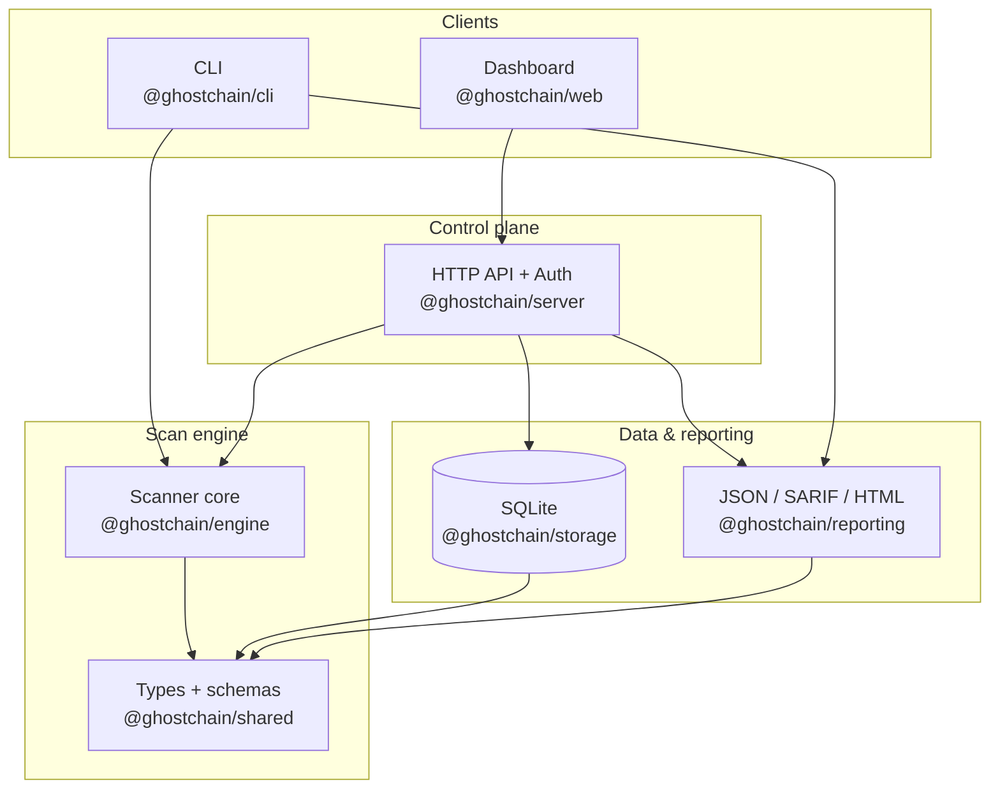
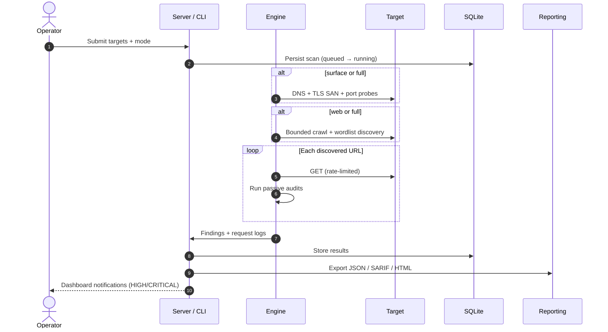
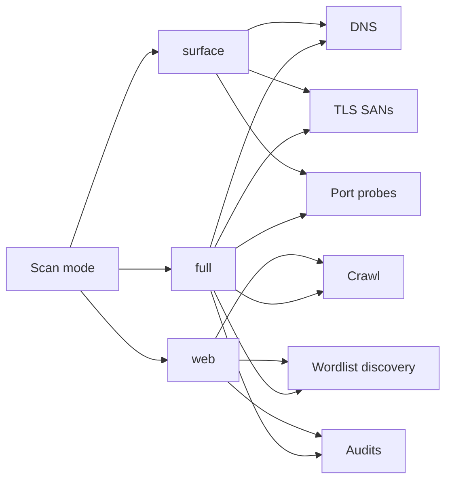

# GhostChain

> **Defensive exposure scanner** — map attack surface, crawl safely, audit misconfigurations, and ship SARIF-ready reports.

[](https://nodejs.org/)
[](https://www.typescriptlang.org/)
[](LICENSE)

**Repository:** [github.com/shep95/link-backend-scrapper](https://github.com/shep95/link-backend-scrapper)

GhostChain is a TypeScript monorepo for **authorized** security assessments. It combines surface mapping (DNS, TLS SANs, port probes), bounded web crawling, wordlist discovery, and passive audits — with SQLite history, multi-format reporting, and a live dashboard.

---

## Why GhostChain

| Capability | What you get |
|---|---|
| **Surface mapping** | DNS records, TLS certificate SANs, safe TCP port probes |
| **Web intelligence** | Crawl without sitemap dependency; extract links, scripts, forms |
| **Content discovery** | Configurable wordlists + extension fuzzing (`.env`, `.bak`, …) |
| **Passive audits** | Headers, cookies, CORS, redirects, dir listing, source maps, secret patterns |
| **Operational safety** | Per-host concurrency + token-bucket rate limits |
| **Outputs** | JSON · SARIF · HTML reports + REST API + dashboard |

---

## System architecture



---

## Scan workflow



---

## Scan modes



| Mode | DNS / TLS / Ports | Crawl + discovery | Audits |
|---|---|---|---|
| `surface` | Yes | No | On probed URLs |
| `web` | No | Yes | Yes |
| `full` | Yes | Yes | Yes |

---

## Monorepo layout

```
ghostchain/
├── packages/
│   ├── shared/      # Zod schemas + shared types
│   ├── engine/      # Scanner core (DNS, crawl, audits)
│   ├── storage/     # SQLite persistence
│   ├── reporting/   # JSON, SARIF, HTML exporters
│   ├── cli/         # Headless scanner
│   ├── server/      # REST API + dashboard host
│   └── web/         # Vite dashboard UI
├── .env.example
└── targets.example.txt
```

---

## Quickstart

**Requirements:** Node.js 20+, [pnpm](https://pnpm.io/) 9+

```bash
git clone https://github.com/shep95/link-backend-scrapper.git
cd link-backend-scrapper
pnpm install
cp .env.example .env
pnpm build
pnpm dev
```

Open **http://localhost:8787** (default credentials in `.env`).

### CLI scan

```bash
cp targets.example.txt targets.txt
pnpm scan -- --targets ./targets.txt --out ./out
```

Outputs in `./out`:

- `report.json` — full scan payload
- `report.sarif.json` — CI / GitHub Code Scanning compatible
- `report.html` — human-readable report
- `audit-report.json` / `audit-report.html` — narrative audit, exploit map, API key tests

### Narrative audit pipeline

Every scan runs the **narrative audit pipeline** on downloaded target content. Optionally audit your full codebase too:

```bash
# Scan + audit remote target AND all local source files
pnpm scan -- --targets ./targets.txt --out ./out --audit-codebase .

# Codebase-only audit (no live scan)
pnpm --filter @ghostchain/cli start -- --audit-only --audit-codebase . --out ./audit-out
```

For each file the pipeline:

1. **Reads** the source file
2. **Writes** an original narrative (what the file does)
3. **Analyzes** the narrative for security, workflow, bug, and logical flaws
4. **Writes** a revised narrative with remediation guidance
5. **Emits** suggested code patches and an exploit/takedown map
6. **Tests** all discovered API keys (GitHub, Stripe, Supabase JWT, AWS patterns, etc.)

The audit report includes flaw counts by category, hacker exploit scenarios with patches, and live API key validation results.

---

## Configuration

| Variable | Default | Description |
|---|---|---|
| `PORT` | `8787` | Dashboard / API port |
| `DASHBOARD_USER` | `admin` | Basic auth username |
| `DASHBOARD_PASS` | `change_me` | Basic auth password |
| `SQLITE_PATH` | `./data/ghostchain.sqlite` | Scan history database |
| `MAX_CONCURRENCY_PER_HOST` | `10` | Parallel requests per host |
| `MAX_RPS_PER_HOST` | `5` | Token-bucket rate limit |
| `MAX_CRAWL_DEPTH` | `3` | Max BFS crawl depth |
| `MAX_URLS_PER_HOST` | `5000` | Max URLs per host |

---

## API reference

| Method | Path | Description |
|---|---|---|
| `GET` | `/api/health` | Liveness probe |
| `GET` | `/api/scans` | List scans |
| `POST` | `/api/scans` | Create scan `{ "targets": ["example.com"], "mode": "full" }` |
| `GET` | `/api/scans/:id` | Scan + findings |
| `GET` | `/api/scans/:id/report?format=json\|sarif\|html` | Export report |
| `GET` | `/api/notifications` | Alert feed |
| `POST` | `/api/notifications/:id/ack` | Acknowledge alert |

All `/api/*` routes require **HTTP Basic Auth**.

---

## Finding types

`SECURITY_HEADERS` · `COOKIE_MISCONFIG` · `CORS_MISCONFIG` · `REDIRECT_HYGIENE` · `DIR_LISTING` · `SOURCEMAP_EXPOSED` · `SECRET_POSSIBLE` · `EXPOSED_BACKUP` · `EXPOSED_CONFIG` · `DEBUG_ENDPOINT` · `OPENAPI_EXPOSED` · `TLS_POSTURE` · `INFO`

---

## Development

```bash
pnpm typecheck    # Type-check all packages
pnpm build        # Build all packages
pnpm dev          # Start API server with watch mode
```

Build dashboard separately:

```bash
pnpm --filter @ghostchain/web build
```

---

## Safety & ethics

GhostChain is built for **defensive, authorized** use only.

- Scan systems you own or have explicit written permission to test.
- Rate limits and crawl caps are enabled by default — do not disable them for production targets without approval.
- Secret detection is **pattern-based and detect-only**; rotate any exposed credentials immediately.

---

## License

MIT — see [LICENSE](LICENSE).
